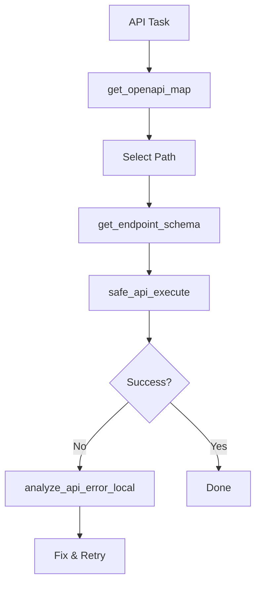

# API Link Skill

This skill ensures you can explore and test external APIs without burning the Cloud AI's context with massive JSON logs or huge documentation files.

## Core Tools

### 1. `get_openapi_map`
- **Use Case**: Getting an overview of what an API can do.
- **Mandate**: **Always** call this first. Never read a raw 5000-line Swagger JSON.

### 2. `get_endpoint_schema`
- **Use Case**: Understanding exactly what body/headers to send to a specific path.
- **Protocol**: Call this only after identifying the target path via the map.

### 3. `safe_api_execute`
- **Use Case**: Testing an endpoint or fetching data.
- **Safety**: This tool automatically truncates large responses. Do not worry about "flooding" the context.

### 4. `analyze_api_error_local` [REQUIRES LOCAL GPU/Ollama]
- **Use Case**: Debugging 400 Bad Request or 500 Internal Server Error.
- **Protocol**: If `safe_api_execute` fails with a complex error, feed it into this tool to get a fixed payload recommendation from the RTX 3060.

## API Exploration Strategy

## Anti-Patterns
- **Reading Raw Specs**: Using `view_file` on a `.json` spec file that is > 100 lines.
- **Verbose Mapping**: Manually summarizing 50 endpoints when `get_openapi_map` can do it.
- **Direct Pinging**: Using `run_command("curl ...")` instead of `safe_api_execute` (curl output isn't truncated!).
