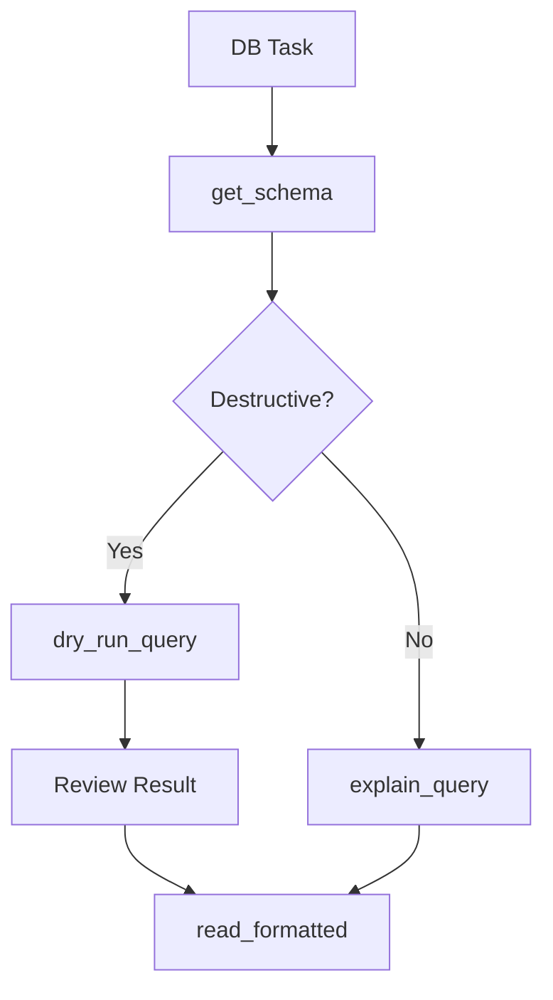

# Cargo DB Skill

This skill provides deterministic database introspection to ensure consistent schema understanding and performance safety.

## Core Tools

### 1. `get_tables`
- **Use Case**: Getting an overview of the data architecture.
- **Protocol**: Use this once per session to reset your "mental model" of the DB.

### 2. `get_schema`
- **Use Case**: Checking column types, nullability, and foreign keys.
- **Mandate**: Verify the schema before writing any raw SQL or updating ORM models.

### 3. `dry_run_query`
- **Use Case**: Validating INSERT/UPDATE/DELETE queries without persisting changes.
- **Mandate**: **ABSOLUTELY MANDATORY** before executing ANY destructive SQL. Wraps the query in a transaction and issues ROLLBACK. Returns affected row count and sample rows.
- **Rule**: NEVER use `read_formatted` for DML without dry-running first.

### 4. `explain_query`
- **Use Case**: Auditing performance for complex joins or large scans.
- **Protocol**: Use this before proposing a database migration or a new reporting query.

### 5. `read_formatted`
- **Use Case**: Executing SELECT queries and returning results in TOON format.
- **Protocol**: Only for read-only SELECTs. For DML, always `dry_run_query` first.

### 6. `find_join_path`
- **Use Case**: Connecting disparate tables.
- **Mandate**: Use this to find the most efficient FK path instead of guessing.

### 7. The TOON Response Protocol
**Mandatory** for data exploration. All `SELECT` results must be transmitted in TOON format (Array of Arrays) to avoid repeating field names in every row.

## Data Strategy

1. **Schema First**: Check `docs/DATABASE.md` first, then verify with `get_schema`.
2. **Dry Run Before Execute**: Always `dry_run_query` before any INSERT/UPDATE/DELETE.
3. **Performance**: Always `explain_query` before proposing new queries.
4. **Relationships**: Map the ERD using `find_join_path`.

## Anti-Patterns
- **Blind DML**: Running INSERT/UPDATE/DELETE via `read_formatted` without `dry_run_query`.
- **Guessing Schema**: Proposing code that assumes a column exists without verification.
- **Ignore Indices**: Writing queries without checking indexed columns via `get_schema`.

