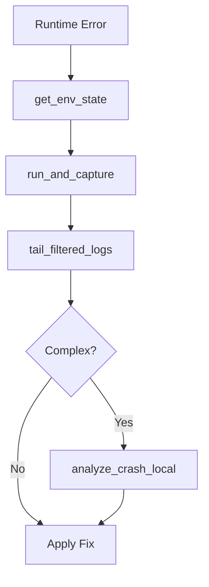

# Debug Probe Skill

This skill focuses on "Container-Aware" observation and intelligent troubleshooting using runtime metrics and local AI analysis.

## Core Tools

### 1. `get_env_state`
- **Use Case**: Checking environment variables BEFORE debugging runtime errors caused by misconfiguration.
- **Mandate**: **ABSOLUTELY MANDATORY** as the first step when debugging any runtime error. Do NOT guess env var values — verify with this tool. Sensitive keys (SECRET, TOKEN, PASSWORD, KEY) are automatically redacted.
- **Optional**: Use `filter_prefix` (e.g. `"DATABASE"`, `"OLLAMA"`) to scope results.

### 2. `run_and_capture`
- **Use Case**: Verifying builds (`make build`), checking environment state, or running generic background commands.
- **Protocol**: Always capture both stdout and stderr to ensure full visibility.
- **Note**: For running Python (pytest) tests, **MANDATORY** use `qa-deck.run_test_compact` instead.

### 3. `tail_filtered_logs`
- **Use Case**: Debugging live race conditions or monitoring background tasks.
- **Mandate**: Always use keywords (e.g., "ERROR", "CRASH", "FATAL") to reduce noise.

### 4. `analyze_crash_local` [REQUIRES LOCAL GPU/Ollama]
- **Use Case**: Pinpointing the root cause of a complex stack trace.
- **Protocol**: Feed the raw messy output from `run_and_capture` directly into this tool. The result is a distilled "Diagnosis" from the local LLM.

### 5. The TOON Response Protocol
**Mandatory** for log analysis and test results. When returning tabular diagnostics or list-based capture data, use the TOON format (Array of Arrays) for extreme efficiency.

## Debugging Workflow

1. **Environment First**: Use `get_env_state` to verify config before anything else.
2. **Isolate**: Use `run_and_capture` for the specific failing command.
3. **Trace**: Check `tail_filtered_logs` for any anomalies during execution.
4. **Diagnose**: Use `analyze_crash_local` on the resulting error log.

## Anti-Patterns
- **Blind Debugging**: Changing code without first verifying env vars with `get_env_state`.
- **Guessing**: Changing code based on assumptions without checking filtered logs.
- **Manual Parsing**: Reading 500 lines of raw tail output instead of using filters.

