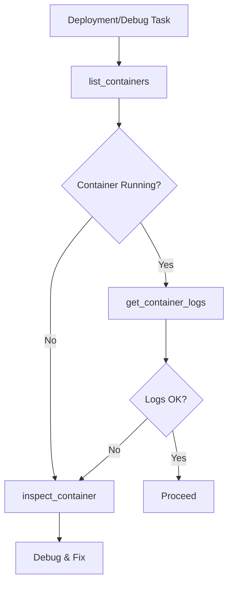

# Docker Forge Skill

This skill provides container-aware debugging by exposing Docker state to AI agents.

## Core Tools

### 1. `list_containers`
- **Use Case**: Checking which containers are running BEFORE debugging connectivity or deployment issues.
- **Mandate**: **ABSOLUTELY MANDATORY** before assuming a service is up or down. Do NOT guess container states — verify with this tool.
- **Protocol**: Use `all=false` (default) for active containers. Use `all=true` when investigating stopped/crashed containers.

### 2. `get_container_logs`
- **Use Case**: Inspecting recent container output to diagnose failures, crashes, or startup issues.
- **Mandate**: **MANDATORY** — never ask the user to manually check Docker logs. Always use this tool.
- **Protocol**: Start with `tail=50` for quick checks. Increase to `tail=100` only if needed. NEVER exceed 200 — the tool enforces this ceiling.

### 3. `inspect_container`
- **Use Case**: Debugging container networking, volume mounts, or environment configuration.
- **Mandate**: **MANDATORY** before diagnosing connectivity or mount issues. Sensitive env vars are automatically masked.
- **Protocol**: Use after `list_containers` to drill into a specific container's configuration.

## Strategic Workflow

1. **List First**: Always `list_containers` to see the current Docker state.
2. **Logs Second**: Use `get_container_logs` with minimum tail to save tokens.
3. **Inspect Third**: Use `inspect_container` for deep configuration debugging.
4. **Never Full Logs**: The tool enforces a 200-line ceiling.

## Anti-Patterns
- **Blind Deployment**: Deploying without checking if previous containers are still running.
- **Manual Log Check**: Asking the user to run `docker logs` manually — always use the tool.
- **Full Log Dump**: Attempting to fetch full container logs (tool blocks this by design).
- **Guessing State**: Assuming a service is running without verification via `list_containers`.
