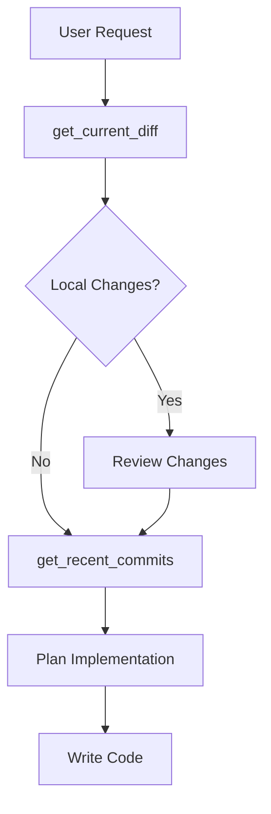

# Git Shuttle Skill

This skill ensures AI agents always understand the current git state before suggesting code changes.

## Core Tools

### 1. `get_current_diff`
- **Use Case**: Understanding what the user has modified locally BEFORE suggesting any new code.
- **Mandate**: **ABSOLUTELY MANDATORY** before writing or modifying code. Do NOT assume the working tree is clean — verify with this tool. Shows both unstaged and staged changes.
- **Protocol**: Call this at the START of any coding task to understand the current context.

### 2. `get_recent_commits`
- **Use Case**: Understanding recent commit history to avoid duplicating work or conflicting with recent changes.
- **Mandate**: **MANDATORY** before making architectural decisions or large refactors. Check what was recently committed to understand the trajectory.
- **Protocol**: Default to 5 commits. Increase to 10-20 only if investigating a specific regression.

## Strategic Workflow

1. **Diff First**: Always check `get_current_diff` before writing code.
2. **History Context**: Use `get_recent_commits` to understand recent project direction.
3. **Avoid Conflicts**: If the user has uncommitted changes, work around them — don't overwrite.

## Anti-Patterns
- **Blind Coding**: Writing code without checking what the user has already modified.
- **Duplicate Work**: Implementing something that was already done in a recent commit.
- **Overwriting**: Suggesting changes to a file the user is actively editing without reviewing the diff.
