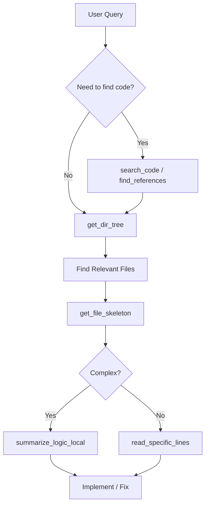

# Radar AST Skill

This skill enables precise, token-efficient codebase exploration by prioritizing structural understanding over raw file reading.

## Core Tools

### 1. `search_code`
- **Use Case**: Finding ALL occurrences of a keyword, variable, or string across the codebase.
- **Mandate**: **ABSOLUTELY MANDATORY** before modifying ANY variable, function, or config key. Do NOT guess where things are used — verify with this tool first.

### 2. `find_references`
- **Use Case**: Locating every definition, import, and usage of a specific symbol (function, class, variable).
- **Mandate**: **ABSOLUTELY MANDATORY** before renaming or refactoring any symbol. Ensures no reference is missed.

### 3. `get_dir_tree`
- **Use Case**: Mapping the project layout or finding a specific module.
- **Protocol**: Always set `max_depth` to `2` or `3` initially to avoid token bloat.

### 4. `get_file_skeleton`
- **Use Case**: Understanding a file's API (classes, methods, arguments) without reading the implementation.
- **Mandate**: **RUTHLESSLY MANDATORY**. Always call this before reading ANY file larger than 100 lines. Failure to do so burns excessive tokens.

### 5. `read_specific_lines`
- **Use Case**: Focusing on a specific function implementation identified via `get_file_skeleton`.
- **Mandate**: Use exact line ranges to stay within context limits.

### 6. The TOON Response Protocol
**Mandatory** for list-based analysis. When returning lists of files, search results, or structural mappings, use the TOON (Array of Arrays) format to minimize boilerplate keys.

### 7. `summarize_logic_local` [REQUIRES LOCAL GPU/Ollama]
- **Use Case**: Explaining "How it works" for complex logic.
- **Protocol**: **Mandatory** for any file > 300 lines or complex logic blocks. Use this to offload long-form analysis to the local RTX 3060 (Ollama), then synthesize the result for the user.

## Strategic Workflow

## Anti-Patterns
- **Blind Modification**: Editing a variable without first running `search_code` to find all its usages.
- **Rename without References**: Renaming a function without `find_references` — guaranteed missed imports.
- **Full Reading**: Using `view_file` on 500+ line files without a skeleton review.
- **Manual Summary**: Trying to explain a 1000-line file manually instead of using `_local` tools.

