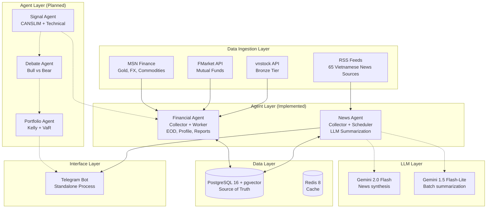
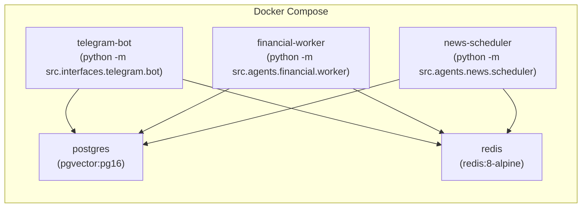

# Architecture — xalpha-researcher

## Overview

xalpha-researcher is a **Multi-Agent System (MAS)** for personalized Vietnamese stock market analysis. It follows a microservice-oriented design where each agent runs as an independent process/container, sharing a common PostgreSQL database.

## High-Level Architecture (Current State)



## Deployment Architecture



Each application service uses the **same Docker image** (`nqh44/xalpha-researcher`) with a different `command` override.

## Component Responsibilities

| Component | Directory | Status | Responsibility |
|---|---|---|---|
| **Config** | `src/config/` | ✅ Implemented | Pydantic-based settings from environment variables |
| **News Agent** | `src/agents/news/` | ✅ Implemented | RSS collection, HTML scraping, LLM summarization, Telegram reporting |
| **Financial Agent** | `src/agents/financial/` | ✅ Implemented | vnstock data sync (EOD, profiles, financials, market intelligence) |
| **Signal Agent** | `src/agents/signal/` | 🔲 Planned | CANSLIM scoring, technical analysis |
| **Debate Agent** | `src/agents/debate/` | 🔲 Planned | Adversarial Bull/Bear reasoning |
| **Portfolio Agent** | `src/agents/portfolio/` | 🔲 Planned | Kelly Criterion, VaR, position sizing |
| **Data Sources** | `src/data/sources/` | ✅ Implemented | RSS, vnstock, HTML scraper connectors |
| **Data Persistence** | `src/data/persistence/` | ✅ Implemented | Repository pattern for all DB operations |
| **DB Models** | `src/db/models/` | ✅ Implemented | SQLAlchemy ORM models (News, Finance, Company) |
| **LLM Service** | `src/services/llm.py` | ✅ Implemented | Two-stage Gemini pipeline (summarize + synthesize) |
| **Telegram Bot** | `src/interfaces/telegram/` | ✅ Implemented | Standalone polling bot with `/news`, `/status` commands |

## Design Patterns

| Pattern | Usage |
|---|---|
| **Repository Pattern** | `FinancialRepository`, `NewsRepository` abstract DB operations |
| **Worker Pattern** | `FinancialWorker`, `NewsScheduler` as independent long-running processes |
| **Incremental Sync** | Market benchmark date comparison to fetch only missing data |
| **Stub Insertion** | Dead/new tickers get a DB stub to prevent infinite retry loops |
| **Two-Stage LLM** | Flash-Lite for bulk extraction, Flash for synthesis (91% cost savings vs Pro) |
| **Graceful Degradation** | All API calls wrapped with retry + fallback to None |

## Data Flow (Implemented)

```
Financial APIs (vnstock) → FinancialCollector → FinancialRepository → PostgreSQL
                                                                    ↓
                                              Market Benchmark (VNINDEX) → Skip if up-to-date

News/RSS → NewsCollector → ArticleProcessor → NewsRepository → PostgreSQL
                                                              ↓
                                              LLM Pipeline → Telegram
```
