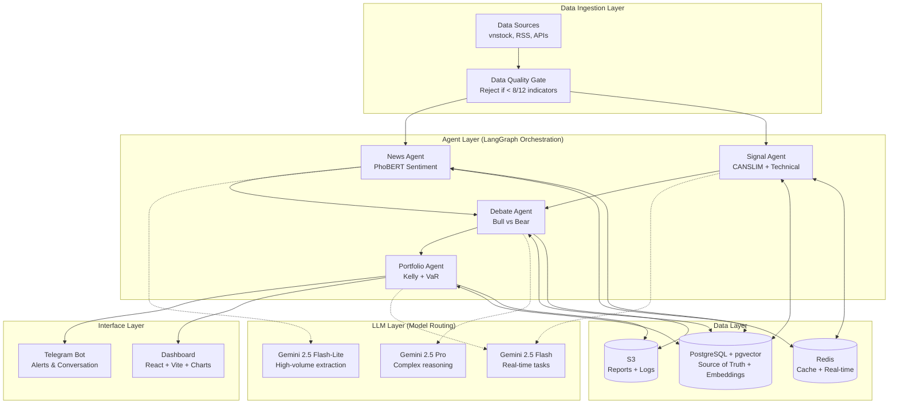

# Architecture — xalpha-researcher

## Overview

xalpha-researcher is a **Multi-Agent System (MAS)** for personalized Vietnamese stock market analysis. It uses 4 specialized AI agents orchestrated via LangGraph, backed by a multi-tier data infrastructure.

## High-Level Architecture



## Design Patterns

| Pattern | Usage |
|---|---|
| **Multi-Agent System** | 4 specialized agents with distinct roles and tools |
| **Graph-based Orchestration** | LangGraph for state management, backtracking, and human-in-the-loop |
| **Model Routing** | Cost-optimized LLM selection based on task complexity |
| **RAG** | pgvector embeddings for grounding LLM responses in financial data |
| **Adversarial Reasoning** | Bull/Bear debate to eliminate confirmation bias |
| **Event-driven Alerts** | Tiered notification system via Telegram |

## Component Responsibilities

| Component | Directory | Responsibility |
|---|---|---|
| **Config** | `src/config/` | Pydantic-based settings from environment variables |
| **Agents** | `src/agents/` | Agent logic for News, Signal, Debate, Portfolio |
| **Data** | `src/data/` | API connectors, ETL pipelines, data quality checks |
| **Models** | `src/models/` | PhoBERT sentiment, XGBoost/RF quantitative models |
| **Risk** | `src/risk/` | Kelly Criterion, VaR, position sizing |
| **DB** | `src/db/` | PostgreSQL + pgvector, Redis clients |
| **LLM** | `src/llm/` | Gemini integration, model router, prompt templates |
| **Interfaces** | `src/interfaces/` | Telegram bot, web dashboard |

## Data Flow

```
Financial APIs → Data Quality Gate → PostgreSQL (structured)
                                   → Redis (real-time cache)
                                   → pgvector (embeddings)

News/RSS → PhoBERT → Sentiment scores → Agent pipeline
                                       → pgvector (embeddings)

Agent Pipeline: News → Signal → Debate → Portfolio → Alerts
```
