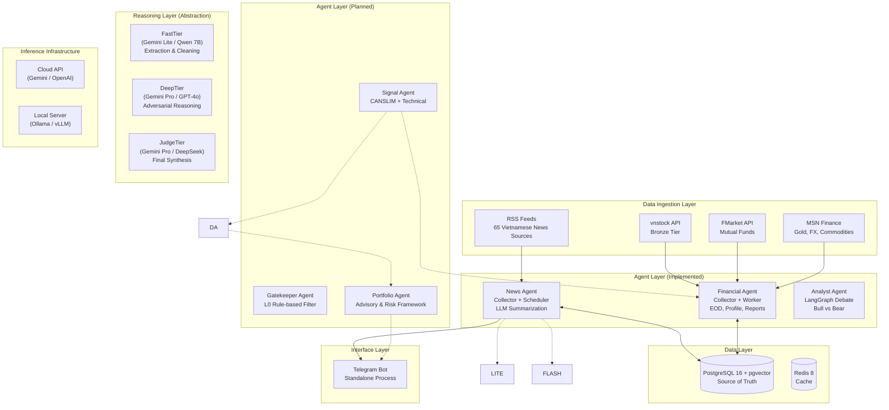
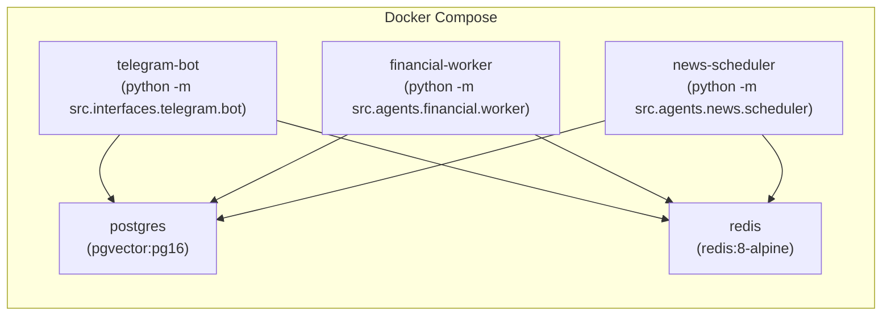

# Architecture — xalpha-researcher

## 1. Overview

xalpha-researcher is a **Multi-Agent System (MAS)** for personalized Vietnamese stock market analysis. It follows a decoupled, microservice-oriented design where specialized agents collaborate via a centralized database and state-graph orchestration.

## Core Design Principles

| Principle | Implementation |
|---|---|
| **Adversarial Reasoning** | Every buy thesis must survive a Bull/Bear debate orchestrated by LangGraph. |
| **Data Quality First** | Automated verification gates ensure low-quality data never triggers a signal. |
| **Idempotency** | All synchronization and worker tasks are safe to retry and resume. |
| **Multi-Model Routing** | Strategic model selection (Gemini Pro/Flash/Lite) balances cost, speed, and depth. |
| **Risk-Adjusted Decision** | Decisions are not binary; they are sized using Kelly Criterion + Value-at-Risk (VaR). |

## High-Level Architecture (Current State)

## Deployment Architecture

Each application service uses the **same Docker image** (`nqh44/xalpha-researcher`) with a different `command` override.

## Component Responsibilities

| Component | Directory | Status | Responsibility |
|---|---|---|---|
| **Config** | `src/config/` | ✅ Implemented | Pydantic-based settings from environment variables |
| **News Agent** | `src/agents/news/` | ✅ Implemented | RSS collection, HTML scraping, LLM summarization, Telegram reporting |
| **Financial Agent** | `src/agents/financial/` | ✅ Implemented | vnstock data sync (EOD, profiles, financials, market intelligence) |
| **Analyst Agent** | `src/agents/analyst/` | ✅ Implemented | LangGraph-based Bull vs Bear adversarial debate |
| **Gatekeeper Agent** | `src/agents/gatekeeper/` | 🔲 Planned | L0 Rule-based filter (Liquidity, Market Cap) |
| **Signal Agent** | `src/agents/signal/` | 🔲 Planned | CANSLIM scoring, technical analysis |
| **Portfolio Agent** | `src/agents/portfolio/` | 🔲 Planned | Advisory recommendations, Risk constraint evaluation, No execution |
| **Data Sources** | `src/data/sources/` | ✅ Implemented | RSS, vnstock, HTML scraper connectors |
| **Data Persistence** | `src/data/persistence/` | ✅ Implemented | Repository pattern for all DB operations |
| **DB Models** | `src/db/models/` | ✅ Implemented | SQLAlchemy ORM models (News, Finance, Company) |
| **LLM Service** | `src/services/llm.py` | ✅ Implemented | Two-stage Gemini pipeline (summarize + synthesize) |
| **Telegram Bot** | `src/interfaces/telegram/` | ✅ Implemented | Standalone polling bot with `/news`, `/status` commands |

## Design Patterns

| Pattern | Usage |
|---|---|
| **Repository Pattern** | `FinancialRepository`, `NewsRepository` abstract DB operations |
| **Worker Pattern** | `FinancialWorker`, `NewsScheduler` as independent long-running processes |
| **Incremental Sync** | Market benchmark date comparison to fetch only missing data |
| **Stub Insertion** | Dead/new tickers get a DB stub to prevent infinite retry loops |
| **Structured Contract** | Unified `MarketIntelligence` model decouples data from reasoning |
| **Two-Stage LLM** | Flash-Lite for bulk extraction, Flash for synthesis (91% cost savings vs Pro) |
| **Local Fallback** | Local Qwen 3.5 handles 60% of baseline article summarization |
| **Graceful Degradation** | All API calls wrapped with retry + fallback to None |

## 3-Layer Risk Architecture

The system implements a defense-in-depth strategy for capital protection:

1.  **L1 — Data Quality Gate**: Validates input signals from `vnstock` and `RSS`. If data points are missing (e.g., <8 indicators), the pipeline stops.
2.  **L2 — Adversarial Filter (Analyst Agent)**: Stress-tests the Buy signal by forcing a Bull vs Bear debate. Final consensus must exceed a 75% confidence score.
3.  **L3 — Logical Constraint (Portfolio Agent)**: Mathematical advisory sizing constraint based on risk framework, diversification metrics, and user portfolio limits. (Advisory only).

## Data Flow (Logical vs Process)

### Logical Pipeline
`Signal Agent` → `News Agent` → `Debate Agent` → `Risk Control` → `Portfolio Agent` → `User Advisory Report`

### Process Pipeline (Docker Compose)
`financial-worker` (Sync) → `Analyst Engine` (LangGraph) → `telegram-bot` (Interface)

## Recommendation Philosophy

The xalpha-researcher platform is a **decision support system**, not an automated trading bot.
The user maintains full control of all trading decisions at all times.
The **Portfolio Agent** only provides structured analysis and suggestions based on mathematical risk metrics and synthesized intelligence. The Portfolio Agent must never perform automated trading.
