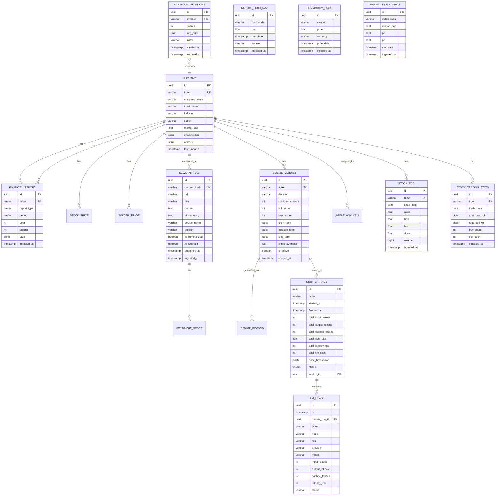

# Database Design — xalpha-researcher

## Overview

Multi-tier database architecture optimized for different data access patterns:

| Tier | Technology | Purpose | Latency |
|---|---|---|---|
| **Cache** | Redis 8 | Real-time prices, sessions, hot vectors | <100ms |
| **Primary** | PostgreSQL 16 | Relational SSOT + pgvector embeddings | <10ms |
| **Archive** | S3-compatible | PDF reports, agent inference logs | Async |

## Entity Relationship Diagram

## Indexing Strategy

| Table | Index | Type | Rationale |
|---|---|---|---|
| `company` | `symbol` | UNIQUE B-tree | Fast lookup by ticker |
| `stock_price` | `(company_id, trading_date)` | Composite B-tree | Time-series queries |
| `news_article` | `content_hash` | UNIQUE B-tree | Fast deduplication |
| `news_article` | `embedding` | IVFFlat (pgvector) | RAG similarity search |
| `news_article` | `published_at` | B-tree | Chronological queries |
| `news_article` | `domain` | B-tree | Domain-specific filtering |
| `sentiment_score` | `(company_id, created_at)` | Composite B-tree | Sentiment timeline |
| `financial_report` | `(company_id, period_end)` | Composite B-tree | Historical financials |
| `debate_verdicts` | `(ticker, is_active)` | Composite B-tree | Active verdict lookup |
| `agent_analysis` | `(company_id, created_at)` | Composite B-tree | Analysis history |
| `alert` | `(portfolio_id, delivered)` | Composite B-tree | Undelivered alert queue |
| `debate_traces` | `ticker` | B-tree | Per-ticker cost history |
| `debate_traces` | `started_at` | B-tree | Chronological trace queries |
| `llm_usage` | `ts` | B-tree | Chronological call log |
| `llm_usage` | `ticker` | B-tree | Per-ticker usage queries |
| `llm_usage` | `debate_run_id` | B-tree | Aggregation by debate run |

## Redis Cache Patterns

| Key Pattern | TTL | Purpose |
|---|---|---|
| `price:{symbol}` | 5s | Latest stock price |
| `sentiment:{symbol}` | 1h | Aggregated sentiment score |
| `canslim:{symbol}` | 24h | CANSLIM scores |
| `session:{user_id}` | 24h | Dashboard user session |
| `rate_limit:{api}` | Varies | API rate limit counters |

## News Storage Optimization

### Performance & Storage (TOAST)
PostgreSQL handles long text using **TOAST** (The Oversized-Attribute Storage Technique). 
- Articles with content > 2KB are stored outside the main data page.
- Performance on metadata queries (filtering by date, source, domain) remains extremely fast because the database only reads the `content` when explicitly requested.
- Sequential scans on metadata are not impacted by the size of the `content` field.

### Image Handling
The system follows a **Text-Only** policy for news articles:
- `ArticleProcessor` utilizes `BeautifulSoup` to strip all HTML tags including ``, `<iframe>`, and `<script>`.
- Only normalized, unescaped text is stored in `content`.
- No binary data or image URLs are stored in the primary database.
