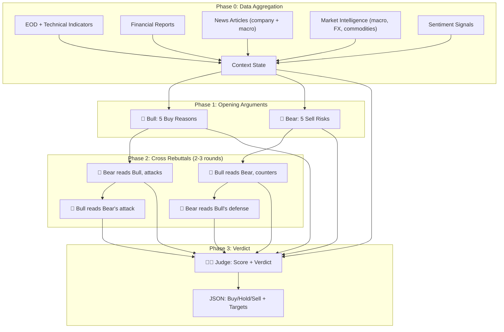
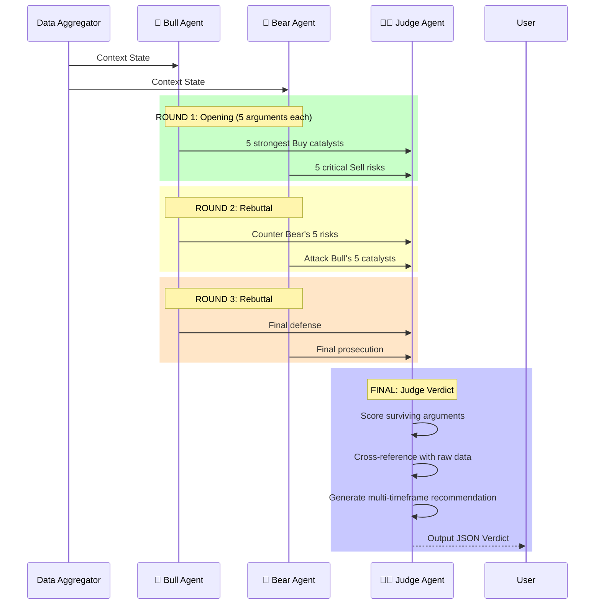

# AI Debating Agents (Bull vs. Bear)

## 1. Feature Description
The Debating Agents system is a multi-agent architectural pattern designed to eliminate LLM hallucination and confirmation bias in financial analysis. It pits an aggressively optimistic agent (Bull) against a ruthlessly pessimistic agent (Bear) in a structured, multi-round debate over a specific stock ticker. The debate is finalized by an impartial Judge agent that scores arguments, discards weak claims, and produces a time-horizon-specific investment recommendation.

## 2. Input Data Sources (Context)

The **Data Aggregator** builds a unified context object from existing system components before the debate begins.

### 2.1. Quantitative Data (from PostgreSQL)

| Source | Table / Repo | Key Metrics |
|--------|--------------|-------------|
| EOD Price & Volume | `stock_eod` | Close, MA20/50/200, RSI(14), MACD, Volume vs. Avg Volume, 52-week high/low |
| Fundamentals | `financial_reports` | Revenue growth (QoQ, YoY), EPS, P/E, P/B, ROE, ROA, Debt/Equity |
| Company Profile | `company_profiles` | Industry, Sector, Market Cap, Shareholder structure |
| Market Indices | `market_index_stats` | VNINDEX trend, VN30 performance, breadth (advance/decline) |
| Macro Indicators | `macro_indicators` | Interest rates, GDP growth, CPI, FX rates (USD/VND) |
| Commodity Prices | `commodity_prices` | Gold (SJC), Oil (WTI/Brent) — if relevant to the sector |

### 2.2. Qualitative Data (from News Agent)

| Source | Table / Repo | Usage |
|--------|--------------|-------|
| Company-specific News | `news_articles` (filtered by ticker/industry keywords) | Direct catalysts or risks |
| Macro/Geopolitical News | `news_articles` (domain: macro, geopolitics, law) | Systemic risks, policy shifts |
| Sector News | `news_articles` (domain: finance, banking, real_estate, tech) | Industry headwinds/tailwinds |

### 2.3. Sentiment Layer (Derived / External)

| Signal | Source | Interpretation |
|--------|--------|----------------|
| Foreign Net Buy/Sell | EOD data (if available) or news | Institutional confidence indicator |
| Retail Sentiment (VN) | News tone analysis (from synthesis) | FOMO/Panic gauge |
| Global Risk Appetite | Geopolitical news + commodity trends | Risk-on vs Risk-off environment |

## 3. Debate Workflow



### Detailed Round Sequence



## 4. Agent Personas, Logic, and Evaluation Criteria

### 🐂 Bull Agent (The Optimist)
- **Persona:** Aggressive growth investor (Peter Lynch / Cathie Wood style).
- **Mandate:** Find EVERY reason to BUY. Defend the stock at all costs.
- **Evaluation Dimensions:**
  1. **Fundamentals:** Revenue/EPS Growth, improving margins, ROE > 15%.
  2. **Technicals:** Golden cross, RSI recovery from oversold, volume breakout.
  3. **News Catalysts:** Positive earnings surprise, new contracts, government incentives.
  4. **Macro Tailwinds:** Favorable interest rate trajectory, strong GDP, weak VND (for exporters).
  5. **Sentiment:** Foreign net buying, institutional accumulation, positive media coverage.
- **Output per Round:** Exactly 5 structured arguments, each with:
  - `claim`: One-sentence thesis.
  - `evidence`: Specific data points from context.
  - `strength`: Self-assessed 1-10 score.

### 🐻 Bear Agent (The Skeptic)
- **Persona:** Short-seller / Risk auditor (Hindenburg Research / Jim Chanos style).
- **Mandate:** Find EVERY reason to SELL. Expose hidden risks ruthlessly.
- **Evaluation Dimensions:**
  1. **Fundamentals:** Declining margins, rising debt, P/E overvaluation, insider selling.
  2. **Technicals:** Death cross, RSI overbought (>70), declining volume on rallies.
  3. **News Risks:** Lawsuits, regulatory crackdowns, executive departures.
  4. **Macro Headwinds:** Rising rates squeezing leverage, commodity shocks, currency risk.
  5. **Sentiment:** Retail euphoria (FOMO indicator), foreign net selling, negative analyst revisions.
- **Output per Round:** Same structured format as Bull.

### 🧑‍⚖️ Judge Agent (The Arbiter)
- **Persona:** Emotionless, data-driven portfolio manager (Ray Dalio style).
- **Mandate:** Fairly evaluate BOTH sides. Discard arguments destroyed in rebuttal. Output actionable verdict.
- **Scoring Logic:**
  1. For each argument, check if the rebuttal effectively invalidated it.
  2. Surviving arguments get weighted by `strength` and `data_backed` (is the evidence real?).
  3. Cross-reference surviving claims against raw data to catch LLM fabrication.
  4. Compute final `bull_score` vs `bear_score`.
  5. Generate recommendation per time horizon.

## 5. Output Schema (Judge Verdict)

```json
{
  "ticker": "VNM",
  "analysis_date": "2026-03-09",
  "current_price": 68.5,
  "debate_rounds": 3,

  "debate_summary": {
    "bull_surviving_points": [
      "Strong cash flow generation (FCF yield 8.2%)",
      "Domestic consumption recovery post-Tet"
    ],
    "bear_surviving_points": [
      "Market share erosion to TH TrueMilk (-2.3% in Q4)"
    ],
    "destroyed_arguments": [
      "Bull's 'international expansion' claim was invalidated by Bear's data showing negative EBIT from overseas operations"
    ]
  },

  "market_context": {
    "vnindex_trend": "Sideways (1280-1310 range)",
    "sector_outlook": "Consumer Staples: Neutral",
    "macro_environment": "Accommodative (SBV rate cut expected Q2)",
    "foreign_flow": "Net buying +120B VND last 5 sessions"
  },

  "sentiment": {
    "domestic_retail": "Slightly bullish (social media mentions +15%)",
    "institutional": "Accumulating (block trades detected)",
    "global_risk": "Risk-on (VIX at 14, S&P near ATH)"
  },

  "verdict": {
    "decision": "BUY",
    "confidence_score": 72,
    "bull_score": 38,
    "bear_score": 22,

    "short_term": {
      "horizon": "1 month",
      "outlook": "Bullish",
      "entry_price": 68.0,
      "target_price": 72.5,
      "stop_loss": 65.0,
      "risk_reward_ratio": 1.5,
      "rationale": "Technical breakout above MA50 with volume confirmation."
    },
    "medium_term": {
      "horizon": "3-6 months",
      "outlook": "Bullish",
      "entry_price": 68.0,
      "target_price": 80.0,
      "stop_loss": 62.0,
      "risk_reward_ratio": 2.0,
      "rationale": "Earnings recovery cycle + rate cut tailwind."
    },
    "long_term": {
      "horizon": "12+ months",
      "outlook": "Neutral",
      "target_price": 85.0,
      "stop_loss": 58.0,
      "risk_reward_ratio": 1.6,
      "rationale": "Market share risk caps long-term upside unless international expansion proves profitable."
    }
  }
}
```

## 6. Configuration Parameters

| Parameter | Default | Description |
|-----------|---------|-------------|
| `MAX_REBUTTAL_ROUNDS` | 2 | Number of back-and-forth rebuttal rounds (2-3 recommended) |
| `ARGUMENTS_PER_ROUND` | 5 | Number of structured arguments each agent must present |
| `BULL_MODEL` | `gemini-2.5-flash` | LLM model for Bull agent |
| `BEAR_MODEL` | `gemini-2.5-flash` | LLM model for Bear agent |
| `JUDGE_MODEL` | `gemini-2.5-flash` | LLM model for Judge agent (should be the strongest) |
| `NEWS_LOOKBACK_DAYS` | 7 | How many days of news to include in context |
| `EOD_LOOKBACK_DAYS` | 90 | How many days of price history to include |

## 7. Project Structure

```
src/agents/analyst/
├── __init__.py
├── graph.py              # LangGraph StateGraph definition
├── state.py              # Pydantic state model (AnalystState)
├── nodes/
│   ├── data_aggregator.py  # Gathers data from all repos into context
│   ├── bull_agent.py       # Bull opening + rebuttal logic
│   ├── bear_agent.py       # Bear opening + rebuttal logic
│   └── judge_agent.py      # Final scoring and verdict
├── prompts/
│   ├── bull_opening.txt
│   ├── bull_rebuttal.txt
│   ├── bear_opening.txt
│   ├── bear_rebuttal.txt
│   └── judge_verdict.txt
└── tools/
    └── technical.py        # Helper: compute RSI, MACD, MA from EOD data
```

## 8. LangGraph State Definition

```python
from typing import Annotated
from pydantic import BaseModel
import operator

class Argument(BaseModel):
    claim: str
    evidence: str
    strength: int  # 1-10

class DebateRound(BaseModel):
    round_number: int
    bull_arguments: list[Argument]
    bear_arguments: list[Argument]

class AnalystState(BaseModel):
    ticker: str
    context: dict  # All aggregated data
    rounds: Annotated[list[DebateRound], operator.add]
    current_round: int = 0
    max_rounds: int = 3  # 1 opening + 2 rebuttals
    verdict: dict | None = None
```

## 9. Telegram Integration
The debate can be triggered via:
- **Bot command:** `/analyze VNM` → Runs full debate → Sends verdict summary to chat.
- **Scheduled:** After daily financial sync, auto-analyze VN30 tickers and push top signals.

Message format:
```
🧑‍⚖️ PHÁN QUYẾT: VNM — MUA (72% tin cậy)

📊 Bull 38 vs Bear 22

🎯 Ngắn hạn (1T): MUA @ 68.0 → TP 72.5 | SL 65.0
📈 Trung hạn (6T): MUA @ 68.0 → TP 80.0 | SL 62.0
⚖️ Dài hạn (1N+): GIỮ → TP 85.0 | SL 58.0

💡 "Bear lo ngại mất thị phần là có lý, nhưng biên lợi nhuận
đang phục hồi nhờ nguyên liệu giảm giá."
```
