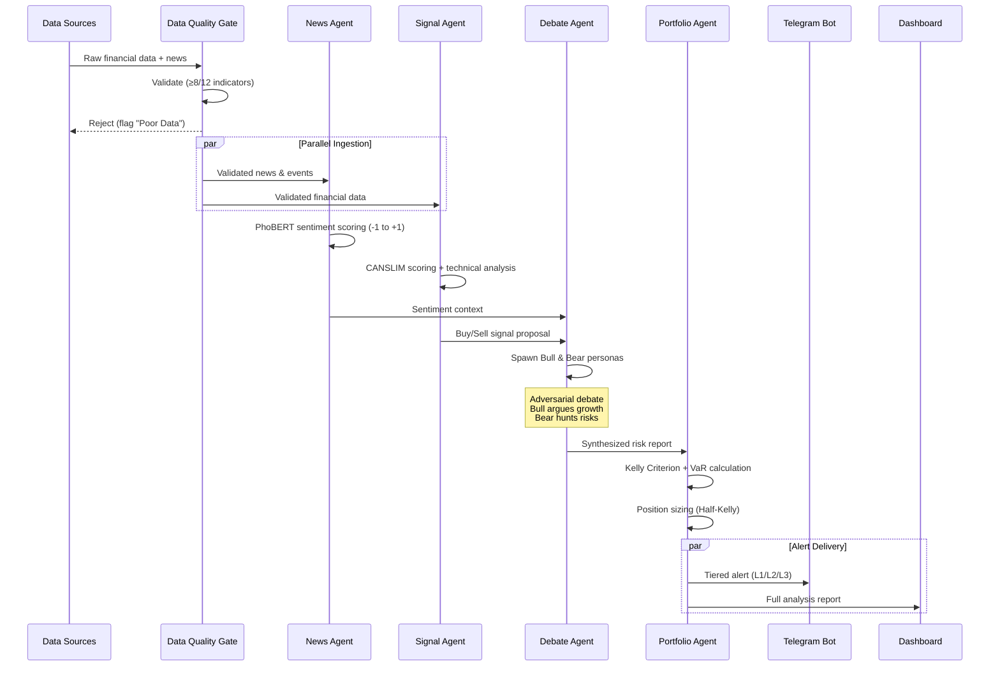
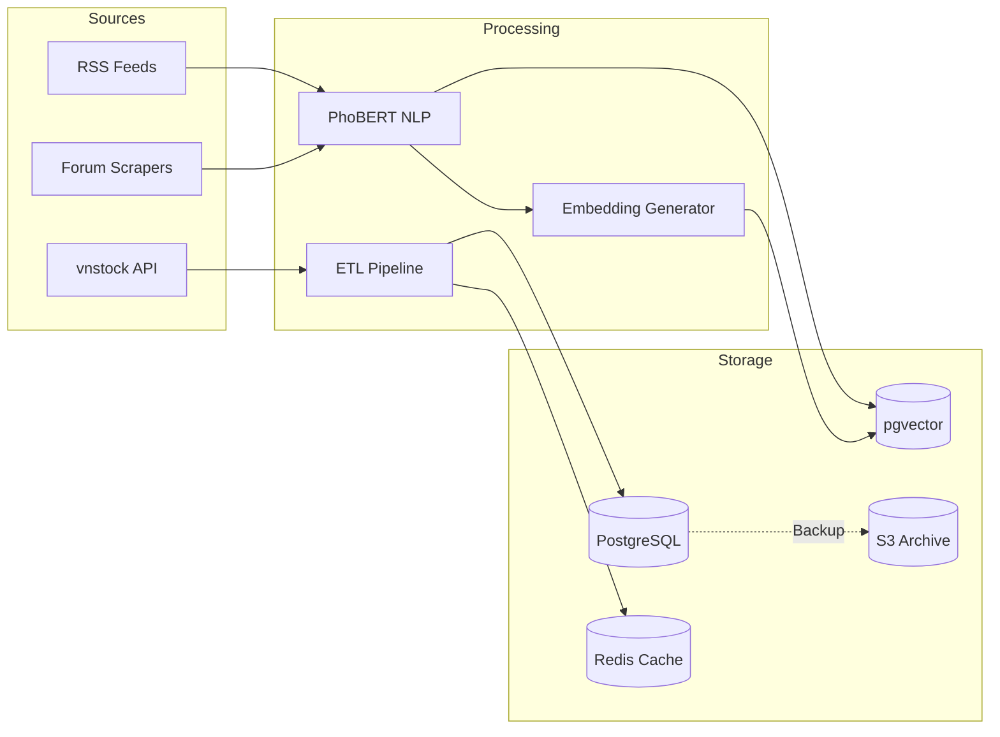
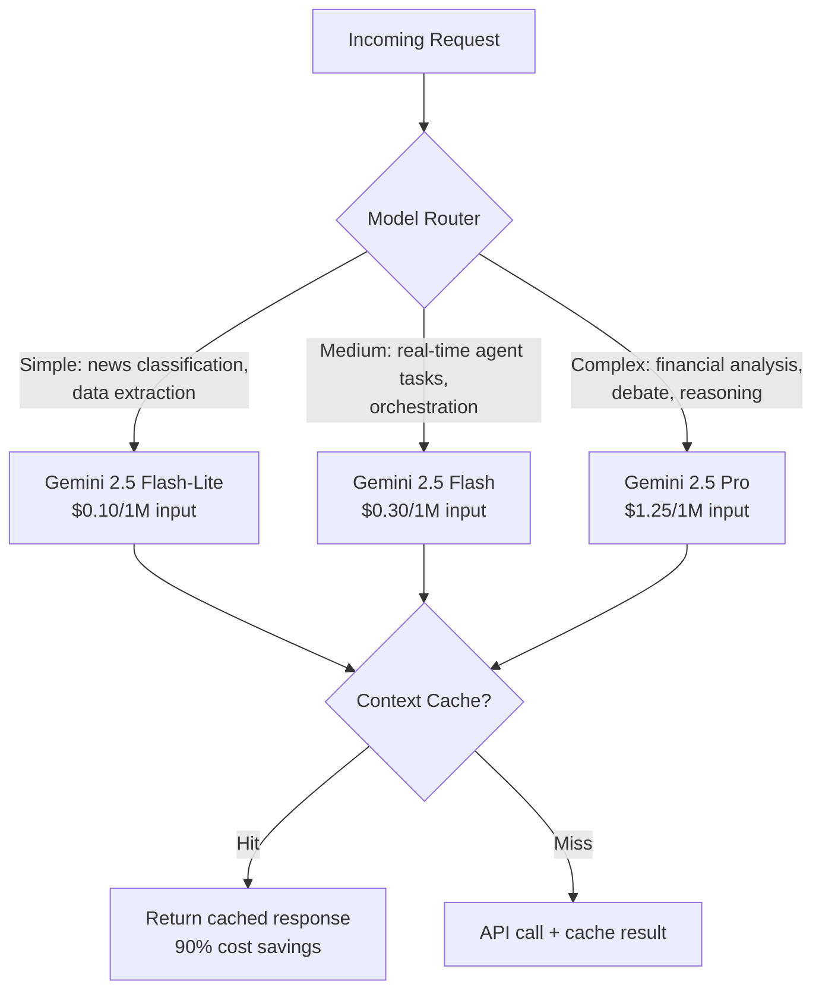
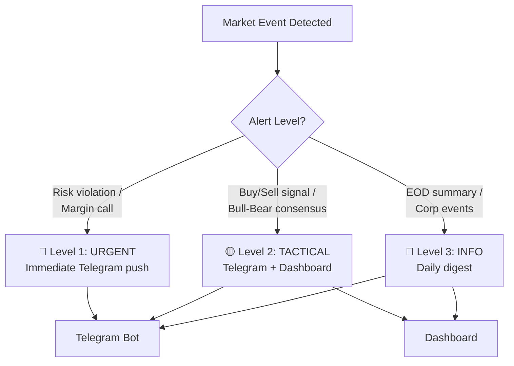
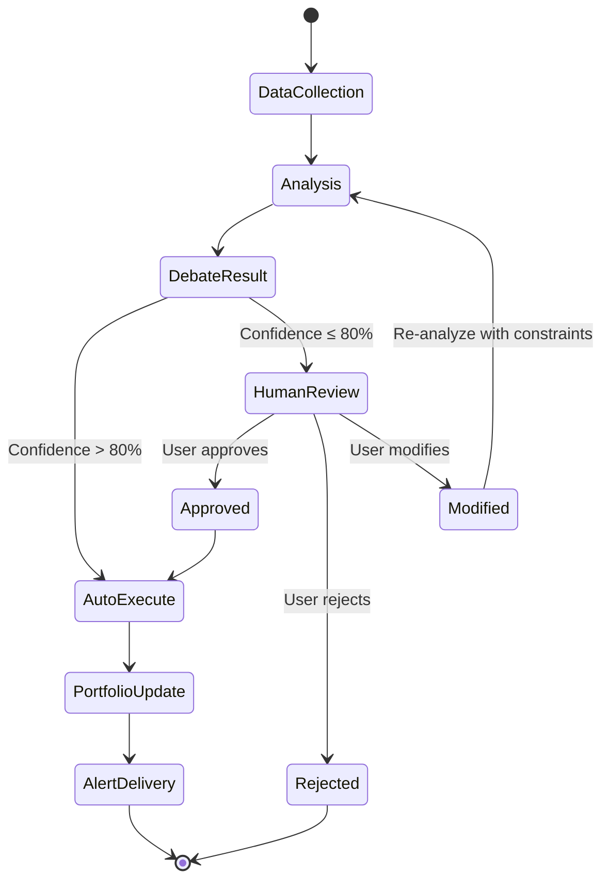

# Data Flows — xalpha-researcher

## 1. Agent Orchestration Flow

Main pipeline from data ingestion to user alert delivery.

## 2. Data Ingestion Pipeline

## 3. LLM Model Routing

## 4. Alert System Flow

## 5. Human-in-the-Loop Flow

