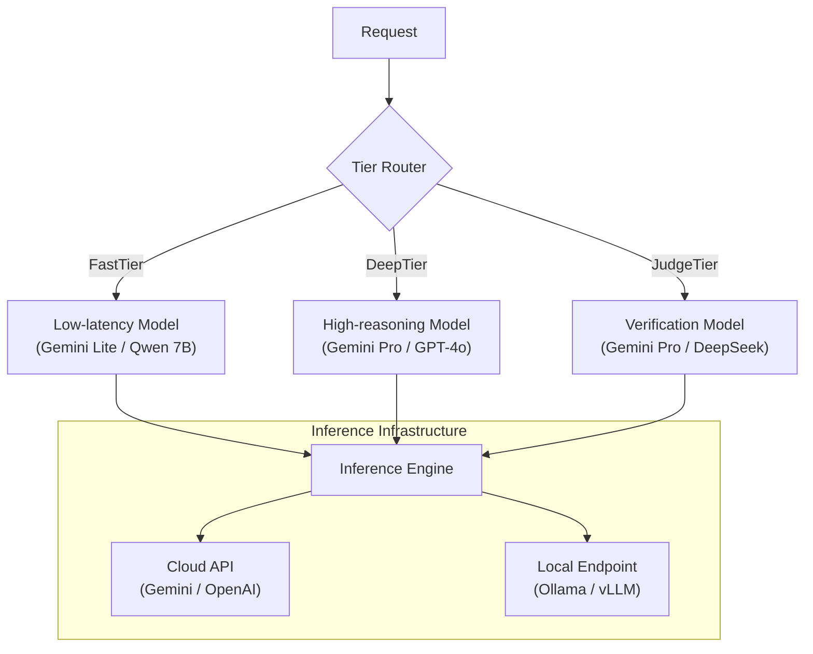
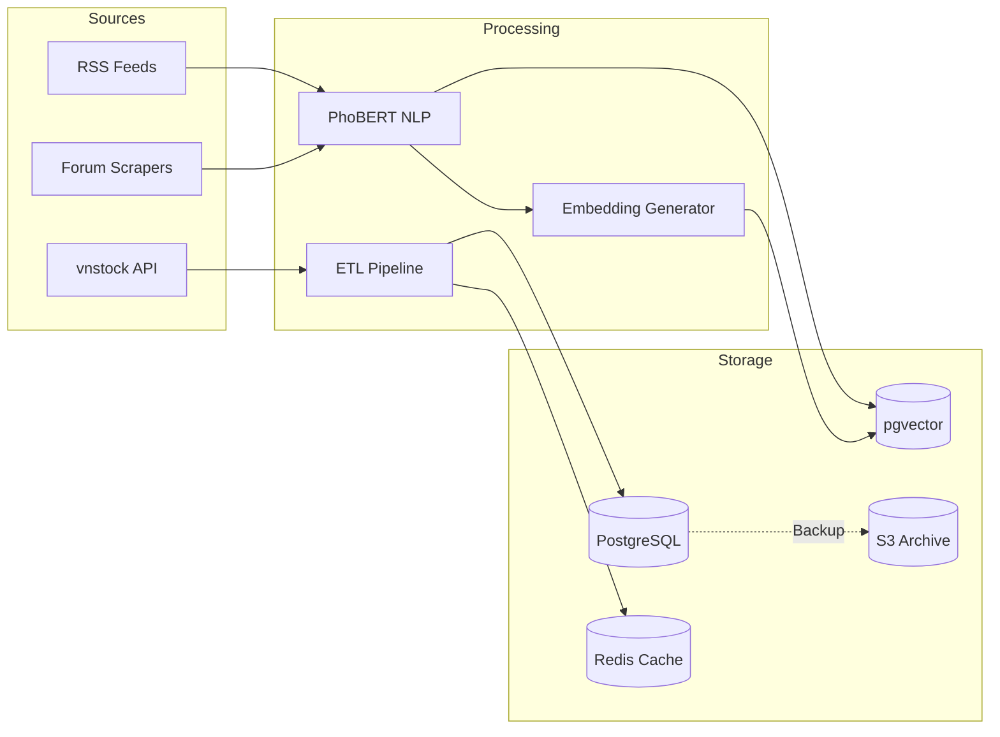

# System Workflows — xalpha-researcher

Detailed end-to-end data and decision flows for the multi-agent stock market analysis system.

## 1. Market Intelligence Flow
Handles the ingestion of qualitative data, sentiment analysis, and storage for RAG.

```text
[ RSS Feeds ] ---> [ News Collector ] ---> [ Article Processor ]
[ News APIs ]          (Async)               (Hash Deduplicate)
                                                 |
                                                 v
[ Telegram ] <--- [ Flash Synthesis ] <--- [ Flash-Lite Summary ]
(Reports)           (Stage 2)               (Stage 1)
```

## 2. L0 Gatekeeper Flow (✅ Implemented)
Rule-based LangGraph node (`gatekeeper_node`) that runs before `data_aggregator`.
Configured via `GATEKEEPER__*` env vars (`GatekeeperSettings` in `src/config/settings.py`).

```text
[ Raw Signal / ticker ]
         |
         v
  +-------------------+
  |  gatekeeper_node  |
  +---------+---------+
            |
  Checks (in order, short-circuit on first failure):
    1. WARN_LIST        — admin-blocked tickers
    2. NO_COMPANY_DATA  — ticker absent from company_profiles
    3. LOW_MARKET_CAP   — market_cap < 100B VND (configurable)
    4. LOW_VOLUME       — 30d avg vol < 100K shares (configurable)
    5. CACHE_HIT        — same-day verdict already exists with
                          confidence >= cache_confidence_threshold (70)
            |
     Pass --+-- Fail
      |              |
      v              v
[ data_aggregator ]  [ END ]  (gatekeeper_passed=False, skip_reason set,
                               DebateTrace finalized as "skipped")
```

## 3. Signal Generation Flow
Processes quantitative financial data to produce high-probability trading signals.

```text
[ vnstock API ] ---> [ Financial Collector ] ---> [ PostgreSQL ]
                         (Incremental Sync)        (EOD, Reports)
                                                       |
                                                       v
[ Signal Agent ] <--- [ Technical Engine ] <--- [ Data Quality Gate ]
(Scoring Layer)          (RSI, MACD, MA)           (>=8/12 Indicators)
       |
       v
[ CANSLIM Scorer ] ---> [ Signal Proposal ] ---> [ Bull vs Bear Queue ]
```

## 3. Debate Flow (Analyst Agent Orchestration)
Adversarial reasoning state-machine implemented via **LangGraph**.

```text
   [ DebateEngine.analyze ]
           |
           v
   Create debate_traces row       (status="running", debate_run_id assigned)
           |
           v
   +-------------------+
   |  gatekeeper_node  | (L0 rule checks — see §2 above)
   +---------+---------+
             |
      Pass --+-- Fail --> END  (trace finalized as "skipped", None returned)
             |
             v
   +-------------------+
   |  Data Aggregator  | (Context Building: EOD + News + Reports)
   +---------+---------+
             |
    +--------+--------+      (Parallel Fan-out)
    |                 |
    v                 v
[ Bull Agent ]   [ Bear Agent ]   <-- each call logs to llm_usage (debate_run_id)
(Pro-Thesis)     (Anti-Thesis)
    |                 |
    +--------+--------+      (Parallel Fan-in)
             |
             v
      +------------+
      |  Join Node | (Round Increment)
      +------+-----+
             |
             v
     { Round > Max? } ----(NO)----+
      /         \                 |
    (YES)        \                |
     /            \               |
    v              +--------------+
[ Judge Agent ]                       <-- logs to llm_usage
(Consensus & Verdict)
    |
    v
{ Confidence < 75 OR retry? }
    |
    v
[ Referee Agent ]                     <-- logs to llm_usage (conditional)
    |
    v
   [ END ]
           |
           v
   Finalize debate_traces row    (aggregate totals, node_breakdown, cost_usd)
   O3 alert if input_tokens > 200K
```

### 3.1 LangGraph State Transitions

| From Node | To Node | Condition | Responsibility |
|---|---|---|---|
| `START` | `gatekeeper` | Always | L0 rule-based filter before any LLM work |
| `gatekeeper` | `data_aggregator` | `gatekeeper_passed == True` | All checks pass — proceed to context building |
| `gatekeeper` | `END` | `gatekeeper_passed == False` | Short-circuit; trace marked "skipped" |
| `data_aggregator` | `bull`, `bear` | Always | Parallel execution of personas |
| `bull`, `bear` | `join` | Always | Sync parallel results into shared state |
| `join` | `bull`, `bear` | `current_round <= max_rebuttals` | Loop for additional rebuttal rounds |
| `join` | `judge` | `current_round > max_rebuttals` | End debate and summarize |
| `judge` | `END` | Always | Final structured Verdict generation |

## 4. Cost Optimized Debate Flow
Escalation logic between local and cloud LLMs to minimize API expenses.

```text
[ Debate Trigger ]
       |
       v
[ Local LLM (Qwen) ] -----------------> [ Judge Node ]
(Bull/Bear Rounds)                          |
                                            v
                                   { Confidence > 80%? }
                                    /               \
                       (YES)       /                 \ (NO)
                      /           v                   \
           [ Final Verdict ] <--- [ Gemini 2.5 Pro ] <--- [ Escalation ]
                                  (Deep Analysis)
```

## 5. Portfolio Agent Decision Flow (Advisory)
Generates risk-adjusted recommendations for the user's manually maintained portfolio. **It never executes trades.**

```text
User Portfolio
       ↓
Portfolio Agent
       ↓
Fetch debate results
Fetch signal ratings
Fetch news sentiment
       ↓
Risk evaluation
       ↓
Generate advisory suggestions
       ↓
Return recommendation report
```

## 7. Notification Flow
Multi-tiered delivery of insights and alerts.

```text
[ Verdict Issued ]
       |
       v
[ Alert Classifier ]
       |
       +---> [ 🔴 Level 1: Urgent ] ---> [ Telegram Push ]
       |     (Risk violating, panic)     (Sound enabled)
       |
       +---> [ 🟡 Level 2: Tactical ] ---> [ Telegram + Dashboard ]
       |     (Signal consensus)          (AI Chart Overlay)
       |
       +---> [ 🔵 Level 3: Info ]     ---> [ Daily Digest ]
             (EOD summary, macro)
```

## 8. End of Day Analysis Flow
Global market re-evaluation after exchange close.

```text
[ Market Close ] ---> [ Financial Worker ] ---> [ Sync Benchmarks ]
                          (APScheduler)           (VNINDEX, VN30)
                                                       |
                                                       v
[ Global Digest ] <--- [ Macro Aggregator ] <--- [ Global Indices ]
(Unified Context)         (Gold, FX, Oil)           (DJI, S&P 500)
       |
       v
[ Telegram Report ] <--- [ Lena Persona LLM ] <--- [ Summary Engine ]
```

---

## 9. Model-Agnostic Reasoning Tiers (UAP Compliance)

The system routes requests across tiers to optimize cost and reasoning depth.



## 10. Data Ingestion Pipeline (Technical)



