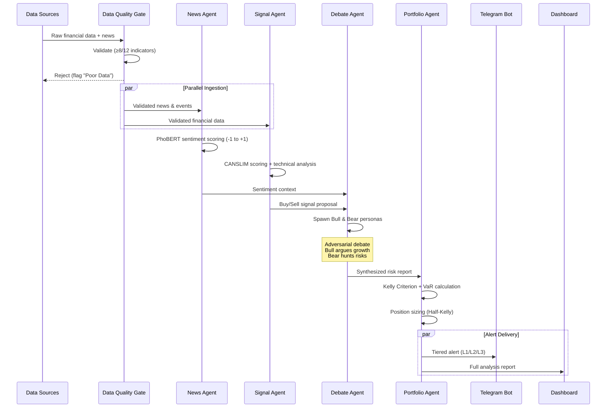
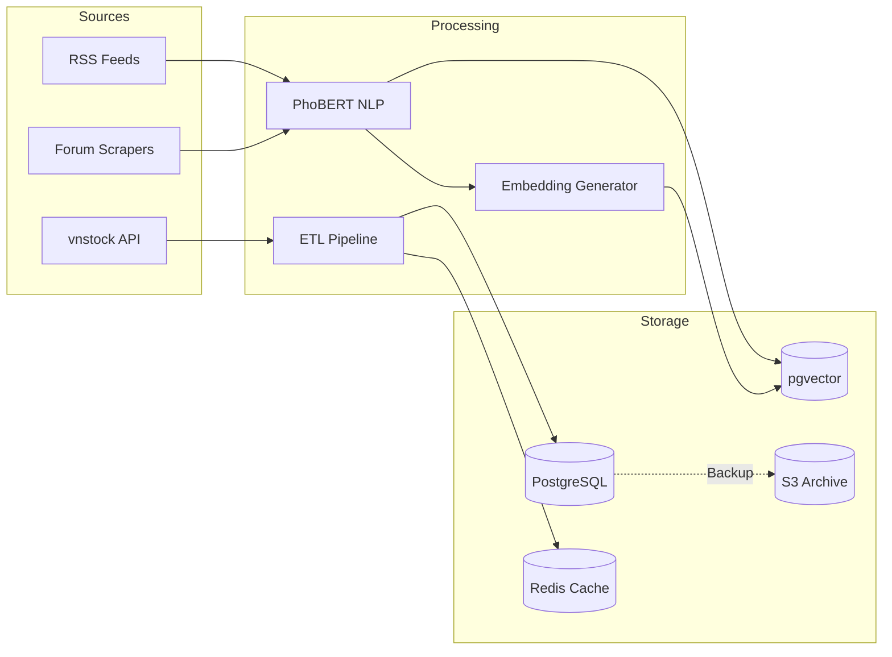
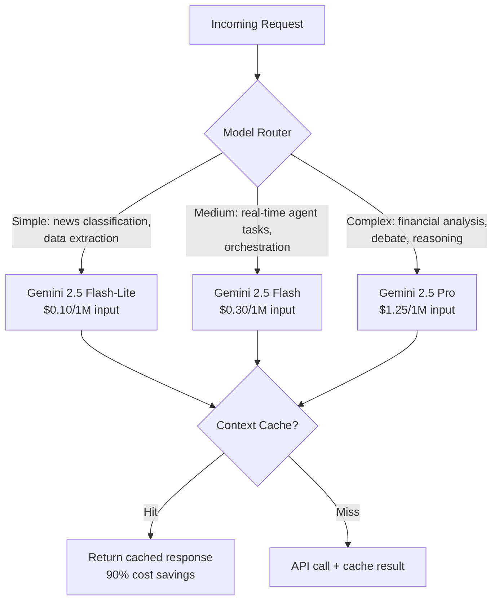
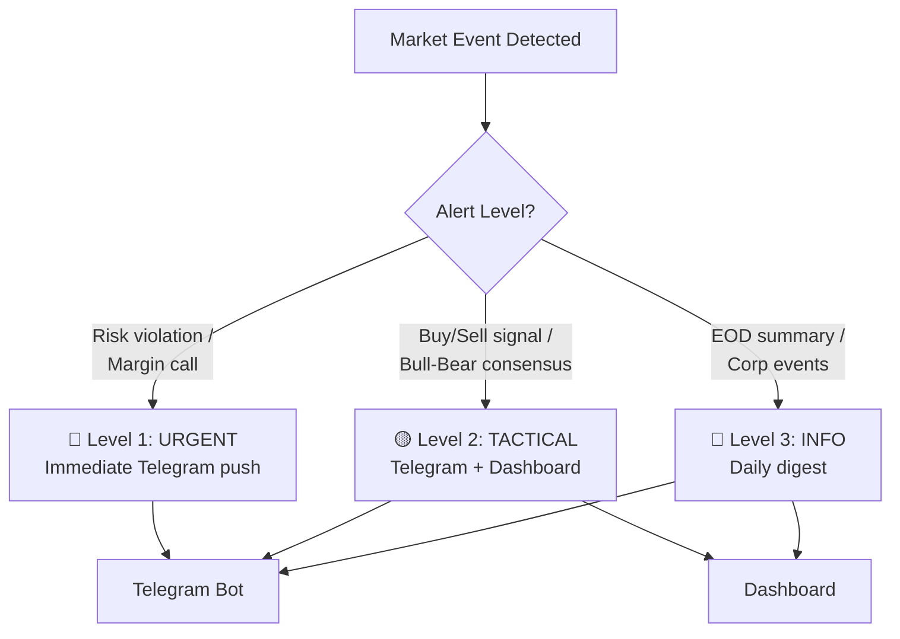
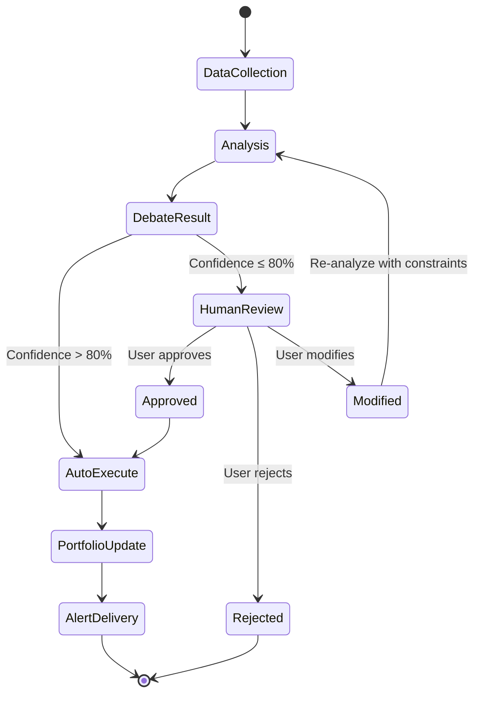
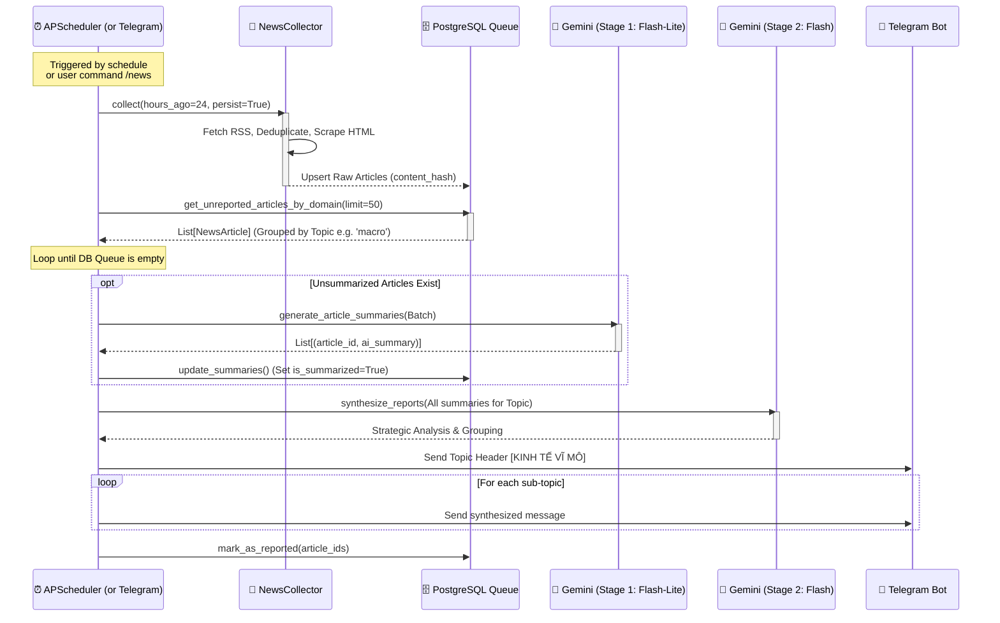
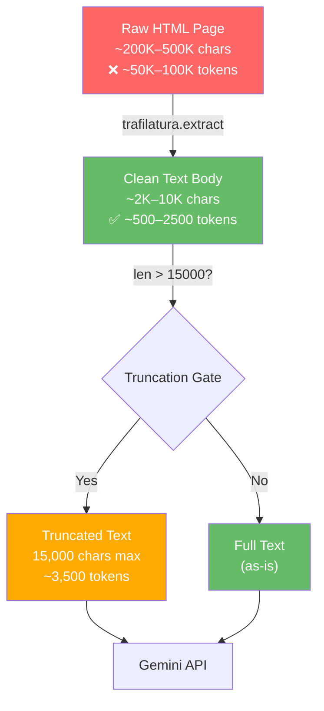
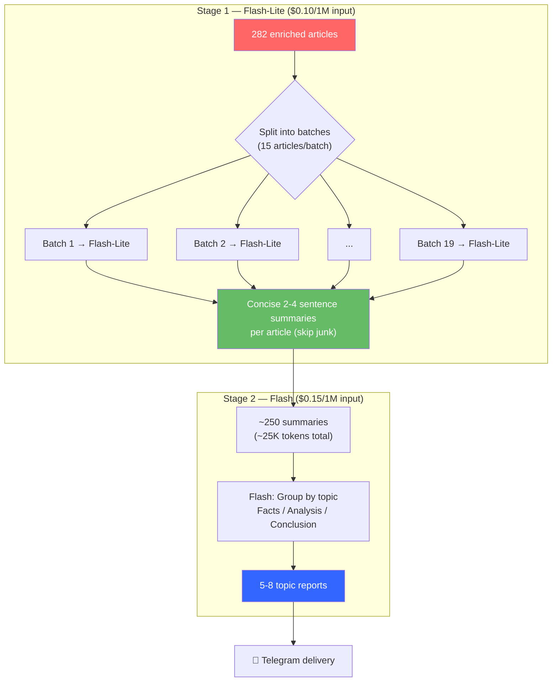

# Data Flows — xalpha-researcher

## 1. Agent Orchestration Flow

Main pipeline from data ingestion to user alert delivery.

## 2. Data Ingestion Pipeline

## 3. LLM Model Routing

## 4. Alert System Flow

## 5. Human-in-the-Loop Flow

## 6. News Collection & Summarization Flow

Detailed implementation of how the News Agent collects, deduplicates, scrapes,
and summarizes articles before delivering reports to the user.

### 6.1 End-to-End Pipeline

### 6.2 Token Optimization Strategy

### 6.3 Key Design Decisions

| Decision | Rationale |
| :--- | :--- |
| Dedup **before** scraping | Avoids wasting HTTP requests on known articles |
| Trafilatura over BeautifulSoup | Purpose-built for article extraction; handles boilerplate removal automatically |
| `MAX_ARTICLE_CHARS = 15,000` | Keeps each article under ~3,500 tokens; prevents context window overflow |
| Graceful degradation on scrape failure | Falls back to short RSS summary; never crashes the pipeline |
| Persist **after** enrichment | DB always stores the richest version of the article available |
| `content_hash` = `SHA256(title\|link)[:16]` | Efficient cross-batch deduplication without full-text comparison |

### 6.4 Component Map

| Component | File | Responsibility |
| :--- | :--- | :--- |
| `RSSCollector` | `src/data/sources/rss_collector.py` | Async RSS feed fetching with concurrency control |
| `SourceRegistry` | `src/data/sources/rss_registry.py` | YAML-based source CRUD and filtering |
| `ArticleProcessor` | `src/data/processing/article_processor.py` | HTML cleanup, hash generation, deduplication |
| `HTMLScraper` | `src/data/sources/html_scraper.py` | Trafilatura-based full-text extraction |
| `NewsCollector` | `src/agents/news/collector.py` | High-level orchestrator composing the above |
| `NewsScheduler` | `src/agents/news/scheduler.py` | APScheduler cron + Telegram notification |
| `GeminiService` | `src/services/llm.py` | Two-stage LLM pipeline (see 6.5) |
| `NewsRepository` | `src/data/persistence/news_repo.py` | PostgreSQL upsert operations |

### 6.5 Two-Stage LLM Summarization Pipeline

The summarization uses a tiered model strategy to minimize cost while maximizing analysis quality.

#### Cost Comparison (282 articles)

| Strategy | Stage 1 (Input) | Stage 2 (Input) | **Total Cost** |
| :--- | ---: | ---: | ---: |
| **Two-stage (current)** | ~339K tokens × $0.10/1M = $0.034 | ~25K tokens × $0.15/1M = $0.004 | **~$0.038** |
| Single-stage Flash | — | ~339K tokens × $0.15/1M = $0.051 | ~$0.051 |
| Single-stage Pro | — | ~339K tokens × $1.25/1M = $0.424 | ~$0.424 |

> Two-stage saves **~25%** vs single Flash and **~91%** vs Pro, while still producing Flash-quality analysis in the final output.

#### Configuration

| Parameter | Value | Location |
| :--- | :--- | :--- |
| `BATCH_SIZE` | 15 articles/batch | `src/services/llm.py` |
| `content_preview` limit | 3,000 chars/article | `src/services/llm.py` |
| Stage 1 model | `GEMINI__MODEL_LITE` | `.env` |
| Stage 2 model | `GEMINI__MODEL_FLASH` | `.env` |
| Stage 1 prompt | `src/prompts/news_batch_summarize.txt` | Flash-Lite optimized |
| Stage 2 prompt | `src/prompts/news_synthesis.txt` | Lena persona, topic grouping |
