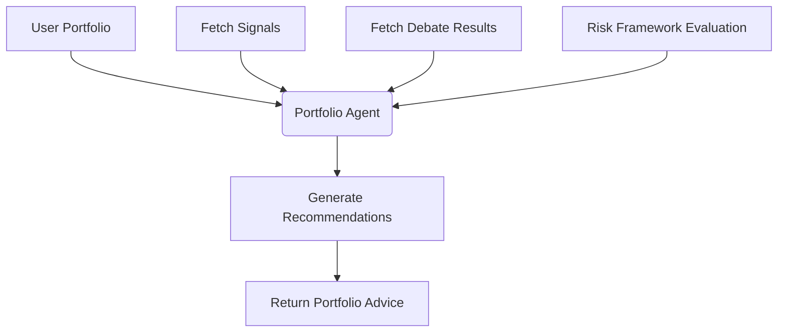

# Feature: Portfolio Agent (Advisory & Risk Management)

**Status: 🔲 Planned**

## 1. Overview

The **Portfolio Agent** (to be implemented in `src/agents/portfolio`) acts as the user's **Advisory Risk Manager**. It reviews the user's manually maintained stock portfolio and combines it with intelligence generated by the other agents (Signal Agent, Debate Agent) to produce tailored, risk-adjusted recommendations.

**🚨 CRITICAL CONSTRAINT: Advisory Only** 
The Portfolio Agent **must never** execute trades automatically. Its explicit purpose is to generate human-readable advice and mathematically sound position sizing targets for the user to review and act upon manually.

## 2. Agent Responsibilities

The Portfolio Agent operates on a schedule or user prompt to:

1.  **Read Current Holdings**: Fetches the user's manually tracked portfolio from the database.
2.  **Gather Intelligence**: Fetches the latest outputs from:
    *   **Signal Agent**: Quantitative ratings, trend strength, CANSLIM score.
    *   **Debate Agent (Analyst)**: Qualitative Verdicts ("Tiềm năng", "Rủi ro").
    *   **News Agent**: News sentiment (bullish, bearish, neutral).
    *   **Risk Control Framework**: Universal constraints (Max position sizing, concentration limits).
3.  **Cross-Reference & Synthesize**: Analyzes each holding in the portfolio against the gathered intelligence and constraints.
4.  **Produce Recommendations**: Outputs specific advisory guidelines:
    *   `HOLD`
    *   `BUY_MORE`
    *   `REDUCE_POSITION`
    *   `EXIT_POSITION`
    *   `WATCHLIST_ADD`
5.  **Calculate Targets**: Suggest price ranges where actions make sense (e.g., `buy_range`, `take_profit_range`, `stop_loss`).
6.  **Capital Allocation**: Suggest portfolio allocation adjustments.

## 3. Decision Workflow



## 4. Risk Constraints

The Portfolio Agent must rigorously enforce the **Risk Control Framework** when making theoretical allocation suggestions. It applies penalties or warnings if the user's manual portfolio violates these constraints:

*   **Maximum Position Size**: Recommend reducing weight if a single symbol exceeds a predefined max capital allocation (e.g., > 20% of NAV).
*   **Sector Diversification**: Warn against over-concentration in a single sector (e.g., > 40% in Banking).
*   **Avoid Concentration Risk**: Flag holdings that are highly correlated if moving together presents outsized drawdown risk.
*   **Capital Preservation Rules**: If the Debate Agent issues a "Rủi ro" (Bearish verdict) with high confidence, the agent strictly forces a `REDUCE POSITION` or `EXIT POSITION` recommendation.

## 5. Output Schema

The Agent produces a standardized JSON schema representing its advisory analysis:

```json
{
  "symbol": "HPG",
  "current_position": {
    "shares": 500,
    "avg_price": 24500,
    "weight": 0.18
  },
  "analysis": {
    "debate_verdict": "bull",
    "debate_confidence": 0.74,
    "signal_rating": 82,
    "news_sentiment": "neutral"
  },
  "recommendation": {
    "action": "buy_more",
    "buy_range": [23000, 24000],
    "take_profit_range": [28000, 30000],
    "stop_loss": 22000
  }
}
```

## 6. Manual Portfolio Management API

Since the system does not integrate directly with brokerages, the portfolio is manually synced via a REST backend and simple HTML UI.

**Endpoints:**
*   `GET /api/v1/portfolio`: Fetches the user's current holdings.
*   `POST /api/v1/portfolio/update`: Adds or updates a position (symbol, shares, avg_price).
*   `DELETE /api/v1/portfolio/{symbol}`: Removes a position entirely.
